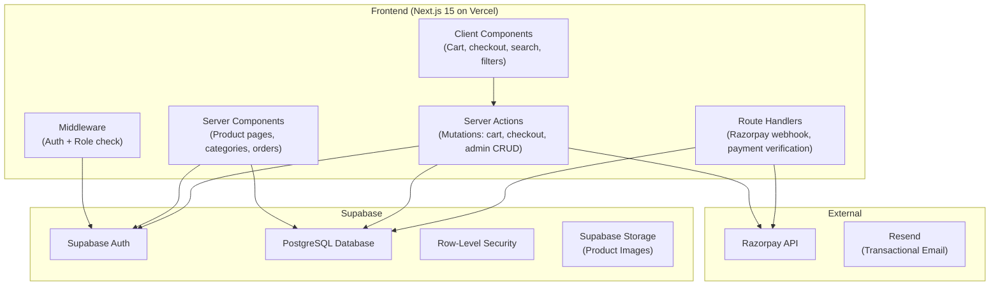
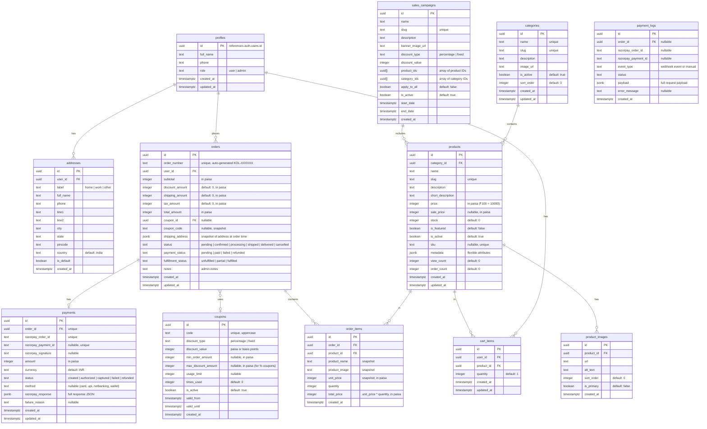
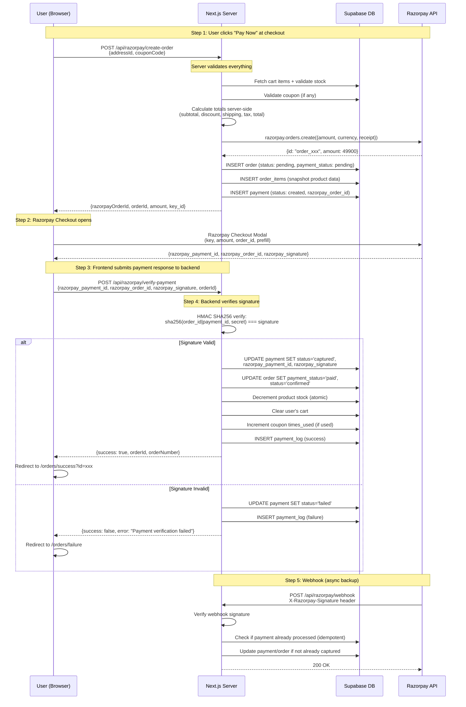
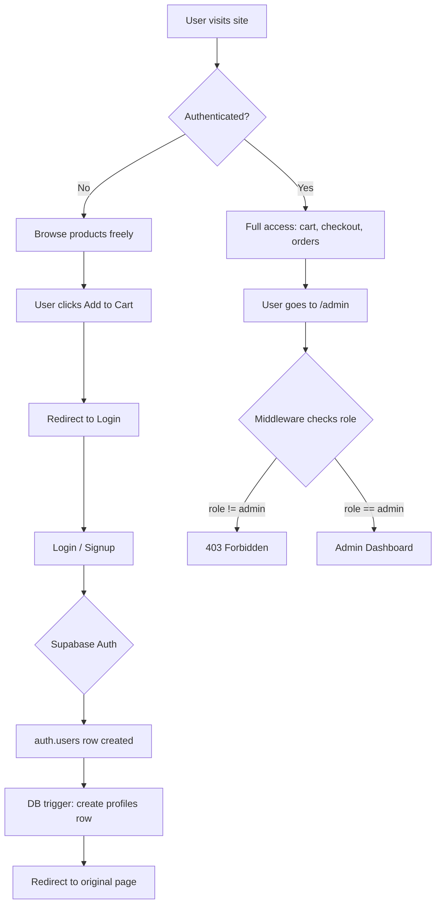

# Kolkata Client — E-Commerce Application Implementation Plan

> **Stack**: Next.js 15 · Supabase · Razorpay · TypeScript · Tailwind CSS v4 · Vercel  
> **Approach**: No Prisma — use Supabase client + raw SQL migrations directly.

---

## User Review Required

> [!IMPORTANT]
> **Razorpay Keys**: You'll need a Razorpay account with both **test** and **live** keys (Key ID, Key Secret, Webhook Secret). Please confirm you have these.
Yes i have these
> [!IMPORTANT]
> **Supabase Project**: You'll need a Supabase project created at [supabase.com](https://supabase.com). Please confirm the project URL and anon key are available.
Yes
> [!IMPORTANT]
> **Domain & Vercel**: Confirm the production domain and Vercel team/account for deployment.
Yes
> [!WARNING]
> **Image Storage**: The plan uses **Supabase Storage** for product images. If you prefer Cloudinary or Vercel Blob, let me know before Phase 2.
Yes
> [!WARNING]
> **Email Provider**: For order confirmation emails, the plan uses Supabase's built-in email for auth and suggests **Resend** (free tier: 3,000 emails/month) for transactional emails. Confirm if this works or if you have another provider.
Yes
---

## Open Questions

> [!IMPORTANT]
> 1. **Business Name & Branding**: What is the store name, primary color, and logo? This affects the entire UI theme. 
store name "Muvira" it should configureable. for ui make it best as you like

> 2. **Product Categories**: Approximately how many categories and products to start? This affects whether we need pagination from day one.
we need pagination

> 3. **Shipping**: Is shipping handled manually (flat rate) or do you need integration with a shipping API (Shiprocket, Delhivery)?
For now i dont want any api integration, will only show the tracking id and the name e.g. bluedart

> 4. **GST/Tax**: Should the app calculate GST on products? If so, what rate(s)?
will figure it out later

> 5. **Multi-admin**: Will there be multiple admin users, or just one?
multi admin

> 6. **OAuth Providers**: Just email/password, or also Google/Facebook login?
Just email/password

> 7. **Currency**: INR only?
Yes
---

## 1. Full Feature List

### Customer Features
| # | Feature | Priority |
|---|---------|----------|
| C1 | Sign up / Sign in (email + password via Supabase Auth) | P0 |
| C2 | Profile page (name, phone, address management) | P0 |
| C3 | Browse products by category | P0 |
| C4 | Search products (full-text search) | P0 |
| C5 | Filter by category, price range, availability | P0 |
| C6 | Sort by price (low/high), newest, popularity | P0 |
| C7 | Product detail page (images, description, price, discount, stock) | P0 |
| C8 | Related products on product page | P1 |
| C9 | Add to cart (authenticated users only) | P0 |
| C10 | Update cart quantity / Remove from cart | P0 |
| C11 | Apply coupon code at checkout | P0 |
| C12 | Checkout with saved user details + address | P0 |
| C13 | Razorpay payment flow | P0 |
| C14 | Order success page | P0 |
| C15 | Order failure / cancel page | P0 |
| C16 | Order history page | P0 |
| C17 | View order details | P0 |
| C18 | Featured products on homepage | P0 |
| C19 | Festival sale banners on homepage | P1 |
| C20 | Mobile responsive UI | P0 |
| C21 | Loading skeletons | P0 |
| C22 | Empty states | P0 |
| C23 | Error states | P0 |
| C24 | Wishlist | P2 (skip v1) |

### Admin Features
| # | Feature | Priority |
|---|---------|----------|
| A1 | Admin login / role protection | P0 |
| A2 | Dashboard with stats (orders, revenue, products, categories, coupons, low-stock) | P0 |
| A3 | Product CRUD (create, edit, delete, images, pricing, stock, category, flags) | P0 |
| A4 | Category CRUD | P0 |
| A5 | Coupon CRUD (%, fixed, min amount, expiry, usage limit) | P0 |
| A6 | Festival / Campaign management (name, dates, discount, banner) | P1 |
| A7 | Orders management (view, search, filter, update status) | P0 |
| A8 | Inventory management (stock tracking, low-stock alerts) | P0 |

### System Features
| # | Feature | Priority |
|---|---------|----------|
| S1 | Server-side Razorpay order creation | P0 |
| S2 | Server-side payment verification (HMAC SHA256) | P0 |
| S3 | Razorpay webhook handler (payment.captured, payment.failed) | P0 |
| S4 | Idempotent payment processing | P0 |
| S5 | Zod input validation on all server actions/routes | P0 |
| S6 | Row-level security on Supabase tables | P0 |
| S7 | Role-based middleware protection | P0 |
| S8 | Secure environment variable management | P0 |
| S9 | Payment failure logging | P0 |
| S10 | SEO metadata (generateMetadata per page) | P1 |
| S11 | Sitemap generation | P1 |
| S12 | Email notification (order confirmation) | P1 |

---

## 2. Recommended Architecture



### Key Architectural Decisions

| Decision | Choice | Rationale |
|----------|--------|-----------|
| **ORM** | No Prisma — Supabase JS client directly | Simpler stack, Supabase client handles types via codegen, less overhead |
| **Data Fetching** | Server Components for reads, Server Actions for mutations | Best Next.js 15 patterns, reduces client bundle |
| **Payment** | Route Handlers (not Server Actions) for Razorpay webhook | Webhooks need raw request body access for signature verification |
| **Auth** | `@supabase/ssr` package | Official recommendation for Next.js App Router |
| **Admin Protection** | Middleware + `profiles.role` check | Fast, runs at edge before page renders |
| **Image Upload** | Supabase Storage | Already in the stack, no extra service needed |
| **State Management** | React Context for cart + Zustand if needed | Simple, no Redux overhead |
| **Styling** | Tailwind CSS v4 (CSS-first config) | User requirement, modern approach |
| **Validation** | Zod schemas shared between client and server | Type-safe, consistent validation |
| **Type Generation** | `supabase gen types` | Auto-generated TypeScript types from DB schema |

---

## 3. Database Schema Design

### Entity Relationship Diagram



### Key Schema Decisions

| Decision | Rationale |
|----------|-----------|
| **Prices in paisa** (integer) | Avoids floating-point issues. ₹499.50 = 49950 paisa. Razorpay also uses paisa. |
| **Snapshots in orders** | `shipping_address`, `product_name`, `unit_price` are copied at order time so order history is immutable even if products/addresses change. |
| **Separate `payments` table** | Clean separation of order logic and payment state. 1:1 with orders. |
| **`payment_logs` table** | Audit trail for all payment events (webhooks, verification attempts, failures). |
| **`metadata` JSONB on products** | Flexible for product-specific attributes (weight, color, size) without schema changes. |
| **`order_number` pattern** | Human-readable `KOL-000001` format, auto-generated via DB sequence. |
| **No wishlist in v1** | Deferred to keep scope manageable. |

---

## 4. Folder Structure

```
kolkata-client/
├── .env.local                          # Local environment variables
├── .env.example                        # Template for env vars
├── next.config.ts                      # Next.js configuration
├── tailwind.config.ts                  # (minimal, v4 uses CSS @theme)
├── postcss.config.mjs
├── tsconfig.json
├── middleware.ts                        # Auth + role protection middleware
├── package.json
│
├── supabase/
│   ├── config.toml                     # Supabase local config
│   └── migrations/
│       ├── 00001_create_profiles.sql
│       ├── 00002_create_categories.sql
│       ├── 00003_create_products.sql
│       ├── 00004_create_cart.sql
│       ├── 00005_create_coupons.sql
│       ├── 00006_create_campaigns.sql
│       ├── 00007_create_orders.sql
│       ├── 00008_create_payments.sql
│       ├── 00009_create_addresses.sql
│       ├── 00010_rls_policies.sql
│       └── 00011_functions_triggers.sql
│
├── src/
│   ├── app/
│   │   ├── globals.css                 # Tailwind v4 @theme + base styles
│   │   ├── layout.tsx                  # Root layout (providers, fonts, metadata)
│   │   ├── not-found.tsx               # Global 404
│   │   ├── error.tsx                   # Global error boundary
│   │   │
│   │   ├── (auth)/                     # Route group: auth pages
│   │   │   ├── login/
│   │   │   │   └── page.tsx
│   │   │   ├── signup/
│   │   │   │   └── page.tsx
│   │   │   ├── forgot-password/
│   │   │   │   └── page.tsx
│   │   │   └── layout.tsx              # Auth layout (centered card)
│   │   │
│   │   ├── auth/
│   │   │   ├── callback/
│   │   │   │   └── route.ts            # OAuth callback handler
│   │   │   └── confirm/
│   │   │       └── route.ts            # Email confirmation handler
│   │   │
│   │   ├── (store)/                    # Route group: customer-facing pages
│   │   │   ├── layout.tsx              # Store layout (navbar, footer)
│   │   │   ├── page.tsx                # Homepage
│   │   │   ├── loading.tsx
│   │   │   ├── products/
│   │   │   │   ├── page.tsx            # All products (with filters/search)
│   │   │   │   ├── loading.tsx
│   │   │   │   └── [slug]/
│   │   │   │       ├── page.tsx        # Product detail
│   │   │   │       └── loading.tsx
│   │   │   ├── categories/
│   │   │   │   ├── page.tsx            # All categories
│   │   │   │   └── [slug]/
│   │   │   │       └── page.tsx        # Category products
│   │   │   ├── cart/
│   │   │   │   └── page.tsx            # Cart page
│   │   │   ├── checkout/
│   │   │   │   └── page.tsx            # Checkout page (auth required)
│   │   │   ├── orders/
│   │   │   │   ├── page.tsx            # Order history (auth required)
│   │   │   │   ├── [id]/
│   │   │   │   │   └── page.tsx        # Order detail
│   │   │   │   ├── success/
│   │   │   │   │   └── page.tsx        # Payment success
│   │   │   │   └── failure/
│   │   │   │       └── page.tsx        # Payment failure
│   │   │   ├── profile/
│   │   │   │   └── page.tsx            # User profile (auth required)
│   │   │   └── search/
│   │   │       └── page.tsx            # Search results
│   │   │
│   │   ├── admin/                      # Admin section (role-protected)
│   │   │   ├── layout.tsx              # Admin layout (sidebar, topbar)
│   │   │   ├── page.tsx                # Admin dashboard
│   │   │   ├── loading.tsx
│   │   │   ├── products/
│   │   │   │   ├── page.tsx            # Product list
│   │   │   │   ├── new/
│   │   │   │   │   └── page.tsx        # Create product
│   │   │   │   └── [id]/
│   │   │   │       └── edit/
│   │   │   │           └── page.tsx    # Edit product
│   │   │   ├── categories/
│   │   │   │   ├── page.tsx
│   │   │   │   ├── new/
│   │   │   │   │   └── page.tsx
│   │   │   │   └── [id]/
│   │   │   │       └── edit/
│   │   │   │           └── page.tsx
│   │   │   ├── orders/
│   │   │   │   ├── page.tsx
│   │   │   │   └── [id]/
│   │   │   │       └── page.tsx        # Order detail + status update
│   │   │   ├── coupons/
│   │   │   │   ├── page.tsx
│   │   │   │   ├── new/
│   │   │   │   │   └── page.tsx
│   │   │   │   └── [id]/
│   │   │   │       └── edit/
│   │   │   │           └── page.tsx
│   │   │   ├── campaigns/
│   │   │   │   ├── page.tsx
│   │   │   │   ├── new/
│   │   │   │   │   └── page.tsx
│   │   │   │   └── [id]/
│   │   │   │       └── edit/
│   │   │   │           └── page.tsx
│   │   │   └── inventory/
│   │   │       └── page.tsx            # Stock overview + low-stock
│   │   │
│   │   └── api/
│   │       ├── razorpay/
│   │       │   ├── create-order/
│   │       │   │   └── route.ts        # POST: Create Razorpay order
│   │       │   ├── verify-payment/
│   │       │   │   └── route.ts        # POST: Verify payment signature
│   │       │   └── webhook/
│   │       │       └── route.ts        # POST: Razorpay webhook handler
│   │       └── health/
│   │           └── route.ts            # GET: Health check
│   │
│   ├── actions/                        # Server Actions
│   │   ├── auth.ts                     # signIn, signUp, signOut, resetPassword
│   │   ├── cart.ts                     # addToCart, updateQuantity, removeFromCart, clearCart
│   │   ├── checkout.ts                 # createOrder, applyCoupon, validateCheckout
│   │   ├── profile.ts                  # updateProfile, addAddress, updateAddress, deleteAddress
│   │   ├── admin/
│   │   │   ├── products.ts             # createProduct, updateProduct, deleteProduct, uploadImages
│   │   │   ├── categories.ts           # createCategory, updateCategory, deleteCategory
│   │   │   ├── coupons.ts              # createCoupon, updateCoupon, deactivateCoupon
│   │   │   ├── campaigns.ts            # createCampaign, updateCampaign, deactivateCampaign
│   │   │   ├── orders.ts               # updateOrderStatus, updatePaymentStatus, updateFulfillment
│   │   │   └── dashboard.ts            # getDashboardStats
│   │   └── _helpers.ts                 # requireAuth, requireAdmin helper wrappers
│   │
│   ├── lib/
│   │   ├── supabase/
│   │   │   ├── client.ts               # Browser Supabase client
│   │   │   ├── server.ts               # Server Supabase client
│   │   │   ├── admin.ts                # Service-role client (for admin ops)
│   │   │   └── middleware.ts            # Middleware Supabase client
│   │   ├── razorpay/
│   │   │   ├── client.ts               # Razorpay SDK instance (server-only)
│   │   │   ├── verify.ts               # Signature verification utility
│   │   │   └── webhook.ts              # Webhook signature verification
│   │   ├── validators/
│   │   │   ├── auth.ts                 # Zod schemas for auth
│   │   │   ├── product.ts              # Zod schemas for products
│   │   │   ├── category.ts
│   │   │   ├── coupon.ts
│   │   │   ├── campaign.ts
│   │   │   ├── order.ts
│   │   │   ├── cart.ts
│   │   │   ├── address.ts
│   │   │   └── checkout.ts
│   │   ├── utils/
│   │   │   ├── format.ts               # Price formatting, date formatting
│   │   │   ├── slug.ts                 # Slug generation
│   │   │   ├── constants.ts            # App constants, status enums
│   │   │   └── errors.ts               # Custom error classes
│   │   └── types/
│   │       ├── database.ts             # Auto-generated Supabase types
│   │       ├── api.ts                  # API response types
│   │       └── index.ts                # Re-exports
│   │
│   ├── components/
│   │   ├── ui/                         # Base UI components (shadcn-style)
│   │   │   ├── button.tsx
│   │   │   ├── input.tsx
│   │   │   ├── select.tsx
│   │   │   ├── textarea.tsx
│   │   │   ├── badge.tsx
│   │   │   ├── card.tsx
│   │   │   ├── dialog.tsx
│   │   │   ├── dropdown-menu.tsx
│   │   │   ├── skeleton.tsx
│   │   │   ├── toast.tsx
│   │   │   ├── table.tsx
│   │   │   ├── pagination.tsx
│   │   │   ├── avatar.tsx
│   │   │   ├── separator.tsx
│   │   │   └── sheet.tsx               # Mobile sidebar
│   │   │
│   │   ├── layout/
│   │   │   ├── navbar.tsx              # Store navbar
│   │   │   ├── footer.tsx              # Store footer
│   │   │   ├── mobile-nav.tsx          # Mobile hamburger menu
│   │   │   ├── admin-sidebar.tsx       # Admin sidebar navigation
│   │   │   ├── admin-topbar.tsx        # Admin top bar
│   │   │   └── breadcrumb.tsx
│   │   │
│   │   ├── product/
│   │   │   ├── product-card.tsx        # Product card (grid item)
│   │   │   ├── product-grid.tsx        # Products grid layout
│   │   │   ├── product-images.tsx      # Image gallery/carousel
│   │   │   ├── product-info.tsx        # Price, stock, add-to-cart
│   │   │   ├── product-filters.tsx     # Sidebar filters
│   │   │   ├── product-sort.tsx        # Sort dropdown
│   │   │   ├── related-products.tsx
│   │   │   ├── featured-products.tsx
│   │   │   └── product-skeleton.tsx    # Loading skeleton
│   │   │
│   │   ├── cart/
│   │   │   ├── cart-item.tsx
│   │   │   ├── cart-summary.tsx
│   │   │   ├── cart-icon.tsx           # Navbar cart icon with count
│   │   │   └── empty-cart.tsx
│   │   │
│   │   ├── checkout/
│   │   │   ├── checkout-form.tsx
│   │   │   ├── address-form.tsx
│   │   │   ├── address-selector.tsx
│   │   │   ├── coupon-input.tsx
│   │   │   ├── order-summary.tsx
│   │   │   └── razorpay-button.tsx     # Razorpay checkout trigger
│   │   │
│   │   ├── auth/
│   │   │   ├── login-form.tsx
│   │   │   ├── signup-form.tsx
│   │   │   └── auth-guard.tsx          # Client-side auth check wrapper
│   │   │
│   │   ├── home/
│   │   │   ├── hero-banner.tsx         # Main banner / sale banner
│   │   │   ├── category-grid.tsx       # Category showcase
│   │   │   ├── sale-banner.tsx         # Festival/campaign banner
│   │   │   └── testimonials.tsx        # (optional)
│   │   │
│   │   ├── admin/
│   │   │   ├── stats-card.tsx          # Dashboard stat card
│   │   │   ├── data-table.tsx          # Reusable admin data table
│   │   │   ├── product-form.tsx        # Create/edit product form
│   │   │   ├── category-form.tsx
│   │   │   ├── coupon-form.tsx
│   │   │   ├── campaign-form.tsx
│   │   │   ├── order-status-update.tsx
│   │   │   ├── image-upload.tsx        # Multi-image uploader
│   │   │   ├── low-stock-alert.tsx
│   │   │   └── recent-orders.tsx
│   │   │
│   │   └── shared/
│   │       ├── empty-state.tsx         # Generic empty state
│   │       ├── error-state.tsx         # Generic error state
│   │       ├── search-bar.tsx          # Search input
│   │       ├── price-display.tsx       # ₹ price with discount
│   │       ├── stock-badge.tsx         # In stock / Low stock / Out of stock
│   │       └── loading-spinner.tsx
│   │
│   ├── hooks/
│   │   ├── use-cart.ts                 # Cart context/hook
│   │   ├── use-auth.ts                 # Auth state hook
│   │   ├── use-debounce.ts             # Search debounce
│   │   └── use-toast.ts                # Toast notifications
│   │
│   └── providers/
│       ├── cart-provider.tsx            # Cart context provider
│       ├── auth-provider.tsx            # Auth context provider
│       └── toast-provider.tsx           # Toast notification provider
│
├── public/
│   ├── images/
│   │   ├── logo.svg
│   │   ├── hero-placeholder.jpg
│   │   └── empty-cart.svg
│   └── icons/
│
└── scripts/
    ├── seed.ts                          # Database seeding script
    └── generate-types.sh                # supabase gen types wrapper
```

---

## 5. API Routes & Server Actions

### Route Handlers (for webhooks and payment — need raw request access)

| Method | Path | Purpose | Auth |
|--------|------|---------|------|
| `POST` | `/api/razorpay/create-order` | Create Razorpay order + pending DB order | User |
| `POST` | `/api/razorpay/verify-payment` | Verify Razorpay signature, mark order paid | User |
| `POST` | `/api/razorpay/webhook` | Razorpay webhook events | Webhook signature |
| `GET` | `/api/health` | Health check for monitoring | None |

### Server Actions (for all other mutations)

| File | Action | Purpose | Auth |
|------|--------|---------|------|
| `auth.ts` | `signIn` | Email/password login | None |
| `auth.ts` | `signUp` | Register new user | None |
| `auth.ts` | `signOut` | Logout | User |
| `auth.ts` | `resetPassword` | Send reset email | None |
| `cart.ts` | `addToCart` | Add product to cart | User |
| `cart.ts` | `updateCartQuantity` | Update item quantity | User |
| `cart.ts` | `removeFromCart` | Remove item from cart | User |
| `cart.ts` | `clearCart` | Empty the cart | User |
| `checkout.ts` | `applyCoupon` | Validate and apply coupon code | User |
| `checkout.ts` | `removeCoupon` | Remove applied coupon | User |
| `profile.ts` | `updateProfile` | Update name, phone | User |
| `profile.ts` | `addAddress` | Add shipping address | User |
| `profile.ts` | `updateAddress` | Edit existing address | User |
| `profile.ts` | `deleteAddress` | Remove address | User |
| `profile.ts` | `setDefaultAddress` | Set default shipping address | User |
| `admin/products.ts` | `createProduct` | Create new product | Admin |
| `admin/products.ts` | `updateProduct` | Edit product details | Admin |
| `admin/products.ts` | `deleteProduct` | Soft-delete product | Admin |
| `admin/products.ts` | `uploadProductImages` | Upload to Supabase Storage | Admin |
| `admin/products.ts` | `deleteProductImage` | Remove image | Admin |
| `admin/products.ts` | `reorderImages` | Change image order | Admin |
| `admin/categories.ts` | `createCategory` | Create category | Admin |
| `admin/categories.ts` | `updateCategory` | Edit category | Admin |
| `admin/categories.ts` | `deleteCategory` | Delete category (check products) | Admin |
| `admin/coupons.ts` | `createCoupon` | Create coupon | Admin |
| `admin/coupons.ts` | `updateCoupon` | Edit coupon | Admin |
| `admin/coupons.ts` | `toggleCouponStatus` | Activate/deactivate | Admin |
| `admin/campaigns.ts` | `createCampaign` | Create sale campaign | Admin |
| `admin/campaigns.ts` | `updateCampaign` | Edit campaign | Admin |
| `admin/campaigns.ts` | `toggleCampaignStatus` | Activate/deactivate | Admin |
| `admin/orders.ts` | `updateOrderStatus` | Change order status | Admin |
| `admin/orders.ts` | `updateFulfillmentStatus` | Change fulfillment status | Admin |
| `admin/orders.ts` | `addOrderNote` | Add admin note | Admin |
| `admin/dashboard.ts` | `getDashboardStats` | Fetch dashboard aggregations | Admin |

---

## 6. Razorpay Integration Flow

### Complete Payment Flow Sequence



### Idempotency Strategy

```typescript
// In verify-payment route:
// 1. Check if payment already verified
const existingPayment = await supabase
  .from('payments')
  .select('status')
  .eq('razorpay_order_id', razorpay_order_id)
  .single();

if (existingPayment.data?.status === 'captured') {
  // Already processed — return success without re-processing
  return Response.json({ success: true, already_processed: true });
}

// 2. Proceed with verification only if status is 'created'
```

### Key Security Rules

| Rule | Implementation |
|------|---------------|
| Never trust frontend amount | Server fetches cart, calculates total |
| Never expose secret key | `RAZORPAY_KEY_SECRET` only in server env |
| Verify signature cryptographically | `crypto.createHmac('sha256', secret)` |
| Webhook signature verification | `crypto.createHmac('sha256', webhook_secret)` on raw body |
| Idempotent verification | Check payment status before processing |
| Log everything | `payment_logs` table for audit trail |
| Atomic stock update | Use Supabase RPC for `decrement_stock` function |

---

## 7. Auth Flow with Supabase

### Auth Architecture



### Implementation Details

| Component | Approach |
|-----------|----------|
| **Package** | `@supabase/ssr` (v0.6+) — official for App Router |
| **Client (browser)** | `createBrowserClient()` — for client components |
| **Client (server)** | `createServerClient()` with cookie handling — for server components, server actions |
| **Client (middleware)** | `createServerClient()` in middleware — for session refresh + route protection |
| **Session refresh** | Middleware refreshes expired sessions on every request |
| **Auth check** | Always use `getUser()`, never `getSession()` (JWT could be tampered) |
| **Profile creation** | PostgreSQL trigger: on `auth.users` INSERT → create `profiles` row with role = 'user' |
| **Admin creation** | Manual: update `profiles.role = 'admin'` via SQL or Supabase dashboard |

### Auth Callback Flow

```
1. User signs up → Supabase sends confirmation email
2. User clicks confirm link → redirected to /auth/confirm?token_hash=xxx&type=signup
3. /auth/confirm route exchanges code for session
4. User redirected to homepage (authenticated)
```

### Protected Routes

| Route Pattern | Protection | Method |
|---------------|-----------|--------|
| `/cart`, `/checkout`, `/orders/*`, `/profile` | Authenticated users | Middleware redirect to `/login` |
| `/admin/*` | Admin role only | Middleware checks `profiles.role` |
| Server Actions (cart, checkout, profile) | Authenticated users | `requireAuth()` helper at top of each action |
| Admin Server Actions | Admin role only | `requireAdmin()` helper at top of each action |

---

## 8. Admin Role Protection Strategy

### Multi-Layer Protection

```
Layer 1: Middleware (edge, fastest)
  ├── Check if user is authenticated
  ├── For /admin/* routes: fetch profiles.role
  └── Redirect to /login (unauth) or /403 (non-admin)

Layer 2: Server Actions (server-side)
  ├── requireAdmin() helper checks auth + role
  └── Throws 403 if not admin (defense in depth)

Layer 3: Row-Level Security (database)
  ├── Admin-only tables: only role='admin' can INSERT/UPDATE/DELETE
  └── Users can only read their own orders, cart, addresses

Layer 4: UI (client-side, cosmetic only)
  └── Hide admin links/buttons for non-admin users
```

### Middleware Implementation Pattern

```typescript
// middleware.ts (simplified)
export async function middleware(request: NextRequest) {
  // 1. Refresh session
  const { user } = await supabase.auth.getUser();

  // 2. Protected customer routes
  const protectedPaths = ['/cart', '/checkout', '/orders', '/profile'];
  if (protectedPaths.some(p => pathname.startsWith(p)) && !user) {
    return redirect('/login?next=' + pathname);
  }

  // 3. Admin routes
  if (pathname.startsWith('/admin')) {
    if (!user) return redirect('/login');
    
    const { data: profile } = await supabase
      .from('profiles')
      .select('role')
      .eq('id', user.id)
      .single();
    
    if (profile?.role !== 'admin') {
      return redirect('/'); // or /403
    }
  }
}
```

### `requireAdmin()` Helper

```typescript
// actions/_helpers.ts
export async function requireAdmin() {
  const supabase = await createClient();
  const { data: { user } } = await supabase.auth.getUser();
  
  if (!user) throw new Error('Unauthorized');
  
  const { data: profile } = await supabase
    .from('profiles')
    .select('role')
    .eq('id', user.id)
    .single();
  
  if (profile?.role !== 'admin') throw new Error('Forbidden');
  
  return { user, profile };
}
```

---

## 9. Production-Ready Checklist

### Security
- [ ] All prices calculated server-side only
- [ ] Razorpay signature verified server-side with HMAC SHA256
- [ ] Razorpay webhook signature verified
- [ ] Zod validation on every server action and route handler input
- [ ] Row-level security enabled on all tables
- [ ] Admin routes protected by middleware + server action checks
- [ ] `getUser()` used instead of `getSession()` everywhere
- [ ] No Razorpay secret key exposed to frontend
- [ ] CSRF protection via SameSite cookies (Next.js default)
- [ ] Input sanitization on all text inputs (XSS prevention)
- [ ] SQL injection prevented (Supabase client uses parameterized queries)
- [ ] Rate limiting on auth endpoints (Supabase built-in)

### Payment
- [ ] Razorpay order created on backend only
- [ ] Payment verification is idempotent
- [ ] Failed payment attempts logged
- [ ] Webhook handler processes `payment.captured` and `payment.failed`
- [ ] Stock decremented atomically after payment confirmation
- [ ] Order amount cannot be tampered from frontend
- [ ] Coupon validation happens server-side during order creation

### Performance
- [ ] Server Components used for data display (minimal JS)
- [ ] Images optimized with `next/image`
- [ ] Product pages use ISR or `revalidate` for caching
- [ ] Loading skeletons for all data-fetching pages
- [ ] Dynamic imports for heavy client components (Razorpay checkout, image galleries)
- [ ] Database indexes on frequently queried columns

### Reliability
- [ ] Error boundaries (`error.tsx`) on all route segments
- [ ] Not-found pages (`not-found.tsx`) for invalid slugs
- [ ] Toast notifications for user feedback on all actions
- [ ] Graceful degradation when Razorpay is unavailable
- [ ] Retry logic on failed Supabase queries (built into client)

### Data Integrity
- [ ] Prices stored as integers (paisa) to avoid floating-point errors
- [ ] Order snapshots (product name, price, address) immutable after creation
- [ ] Coupon usage atomically incremented
- [ ] Stock levels atomically decremented
- [ ] `order_number` generated via database sequence (no collisions)

---

## 10. Deployment Checklist for Vercel + Supabase

### Supabase Setup
- [ ] Create production Supabase project
- [ ] Run all migrations against production DB
- [ ] Enable Row-Level Security on all tables
- [ ] Configure auth settings:
  - Site URL: `https://yourdomain.com`
  - Redirect URLs: `https://yourdomain.com/auth/callback`, `https://yourdomain.com/auth/confirm`
  - Email templates customized
  - Email rate limits configured
- [ ] Create Supabase Storage bucket `product-images` with public read access
- [ ] Set storage policies (admin-only upload/delete)
- [ ] Create first admin user and set `profiles.role = 'admin'`
- [ ] Generate TypeScript types: `supabase gen types typescript --project-id xxx > src/lib/types/database.ts`

### Vercel Setup
- [ ] Connect GitHub repository to Vercel
- [ ] Set environment variables:

| Variable | Source |
|----------|--------|
| `NEXT_PUBLIC_SUPABASE_URL` | Supabase dashboard |
| `NEXT_PUBLIC_SUPABASE_ANON_KEY` | Supabase dashboard |
| `SUPABASE_SERVICE_ROLE_KEY` | Supabase dashboard (server-only!) |
| `RAZORPAY_KEY_ID` | Razorpay dashboard |
| `RAZORPAY_KEY_SECRET` | Razorpay dashboard |
| `RAZORPAY_WEBHOOK_SECRET` | Razorpay dashboard > Webhooks |
| `NEXT_PUBLIC_RAZORPAY_KEY_ID` | Same as RAZORPAY_KEY_ID (public) |
| `NEXT_PUBLIC_APP_URL` | `https://yourdomain.com` |
| `RESEND_API_KEY` | Resend dashboard (if using email) |

- [ ] Configure custom domain
- [ ] Enable Vercel Analytics
- [ ] Set Node.js version to 20.x
- [ ] Verify build succeeds
- [ ] Configure Razorpay webhook URL: `https://yourdomain.com/api/razorpay/webhook`
- [ ] Test payment flow in Razorpay test mode
- [ ] Switch Razorpay to live mode and update keys

### Post-Deploy
- [ ] Verify auth flow (signup → email confirm → login)
- [ ] Verify payment flow end-to-end with test card
- [ ] Verify webhook delivery in Razorpay dashboard
- [ ] Verify admin access works
- [ ] Seed initial categories and products
- [ ] Monitor Vercel logs for errors
- [ ] Set up Vercel status alerts

---

## 11. Error Handling Strategy

### Layered Error Handling

| Layer | Mechanism | Purpose |
|-------|-----------|---------|
| **Route Segment** | `error.tsx` | Catches rendering errors, shows retry button |
| **Not Found** | `not-found.tsx` | Product/category/order not found |
| **Loading** | `loading.tsx` | Skeleton UI during data fetch |
| **Server Actions** | Try/catch + typed returns | Return `{ error: string }` or `{ data: T }` |
| **Route Handlers** | Try/catch + proper HTTP status | 400, 401, 403, 404, 500 |
| **Client Components** | Error boundaries + toast | Show error toast, don't crash page |
| **Forms** | Zod validation errors | Field-level error messages |

### Server Action Return Pattern

```typescript
type ActionResult<T = void> = 
  | { success: true; data: T }
  | { success: false; error: string; fieldErrors?: Record<string, string[]> };

// Usage
export async function createProduct(formData: FormData): Promise<ActionResult<Product>> {
  try {
    const parsed = productSchema.safeParse(Object.fromEntries(formData));
    if (!parsed.success) {
      return { success: false, error: 'Validation failed', fieldErrors: parsed.error.flatten().fieldErrors };
    }
    // ... create product
    return { success: true, data: product };
  } catch (error) {
    console.error('createProduct failed:', error);
    return { success: false, error: 'Failed to create product' };
  }
}
```

---

## 12. SEO & Performance Improvements

### SEO

| Feature | Implementation |
|---------|---------------|
| **Dynamic Metadata** | `generateMetadata()` on product, category, and all pages |
| **Open Graph** | OG image, title, description for product pages |
| **Sitemap** | `/sitemap.xml` via `app/sitemap.ts` (auto-generated from products/categories) |
| **robots.txt** | `/robots.txt` via `app/robots.ts` |
| **Structured Data** | JSON-LD `Product` schema on product pages |
| **Canonical URLs** | Set on all pages |
| **Semantic HTML** | Proper `<h1>`, `<main>`, `<nav>`, `<article>` structure |
| **Alt Text** | Required on all product images |

### Performance

| Optimization | Implementation |
|-------------|---------------|
| **ISR** | Product and category pages with `revalidate: 3600` (1 hour) |
| **Server Components** | Default for all data display pages |
| **Dynamic Imports** | Razorpay checkout, image carousel, rich text editor |
| **Image Optimization** | `next/image` with Supabase Storage URLs, blur placeholders |
| **Bundle Splitting** | Admin code separated from store code (route groups) |
| **Database Indexes** | On `products.slug`, `products.category_id`, `orders.user_id`, `orders.order_number` |
| **Streaming** | `loading.tsx` + Suspense boundaries for progressive rendering |
| **Edge Middleware** | Auth check runs at Vercel Edge (fast) |

---

## 13. Suggested UI Pages

### Customer Pages (16)
| Page | Route | Description |
|------|-------|-------------|
| Homepage | `/` | Hero banner, featured products, categories, sale banners |
| Products | `/products` | Product grid with filters, search, sort, pagination |
| Product Detail | `/products/[slug]` | Image gallery, info, add to cart, related products |
| Category Products | `/categories/[slug]` | Products filtered by category |
| Categories | `/categories` | All categories grid |
| Search Results | `/search?q=xxx` | Search results with filters |
| Cart | `/cart` | Cart items, quantity controls, summary |
| Checkout | `/checkout` | Address selection, coupon, order summary, pay button |
| Order Success | `/orders/success` | Confirmation with order details |
| Order Failure | `/orders/failure` | Failure message with retry option |
| Order History | `/orders` | List of past orders |
| Order Detail | `/orders/[id]` | Full order details, items, status |
| Profile | `/profile` | Edit name, phone, manage addresses |
| Login | `/login` | Email/password login form |
| Sign Up | `/signup` | Registration form |
| Forgot Password | `/forgot-password` | Password reset form |

### Admin Pages (14)
| Page | Route | Description |
|------|-------|-------------|
| Dashboard | `/admin` | Stats cards, recent orders, low-stock alerts |
| Products List | `/admin/products` | Data table with search, filter, pagination |
| Create Product | `/admin/products/new` | Product form with image upload |
| Edit Product | `/admin/products/[id]/edit` | Pre-filled product form |
| Categories List | `/admin/categories` | Category table |
| Create Category | `/admin/categories/new` | Category form |
| Edit Category | `/admin/categories/[id]/edit` | Pre-filled category form |
| Orders List | `/admin/orders` | Orders table with filters |
| Order Detail | `/admin/orders/[id]` | Order info + status update controls |
| Coupons List | `/admin/coupons` | Coupon table |
| Create Coupon | `/admin/coupons/new` | Coupon form |
| Edit Coupon | `/admin/coupons/[id]/edit` | Pre-filled coupon form |
| Campaigns | `/admin/campaigns` | Campaign list + CRUD |
| Inventory | `/admin/inventory` | Stock levels, low-stock warnings |

---

## 14. Suggested Component List

### Core UI Components (15)
`Button`, `Input`, `Select`, `Textarea`, `Badge`, `Card`, `Dialog`, `DropdownMenu`, `Skeleton`, `Toast/Sonner`, `Table`, `Pagination`, `Avatar`, `Separator`, `Sheet`

> [!TIP]
> Recommend using **shadcn/ui** to scaffold these. It generates clean, customizable components that work perfectly with Tailwind.

### Layout Components (6)
`Navbar`, `Footer`, `MobileNav`, `AdminSidebar`, `AdminTopbar`, `Breadcrumb`

### Product Components (9)
`ProductCard`, `ProductGrid`, `ProductImages`, `ProductInfo`, `ProductFilters`, `ProductSort`, `RelatedProducts`, `FeaturedProducts`, `ProductSkeleton`

### Cart Components (4)
`CartItem`, `CartSummary`, `CartIcon`, `EmptyCart`

### Checkout Components (6)
`CheckoutForm`, `AddressForm`, `AddressSelector`, `CouponInput`, `OrderSummary`, `RazorpayButton`

### Auth Components (3)
`LoginForm`, `SignupForm`, `AuthGuard`

### Home Components (3)
`HeroBanner`, `CategoryGrid`, `SaleBanner`

### Admin Components (10)
`StatsCard`, `DataTable`, `ProductForm`, `CategoryForm`, `CouponForm`, `CampaignForm`, `OrderStatusUpdate`, `ImageUpload`, `LowStockAlert`, `RecentOrders`

### Shared Components (6)
`EmptyState`, `ErrorState`, `SearchBar`, `PriceDisplay`, `StockBadge`, `LoadingSpinner`

**Total: ~62 components**

---

## 15. Build Plan — Phased Approach

### Phase 0: Project Setup (Day 1)
- [ ] Initialize Next.js 15 with TypeScript + Tailwind CSS v4
- [ ] Set up folder structure
- [ ] Install dependencies (`@supabase/ssr`, `razorpay`, `zod`, `sonner`, etc.)
- [ ] Configure Supabase clients (browser, server, middleware)
- [ ] Set up environment variables
- [ ] Create middleware.ts skeleton
- [ ] Initialize shadcn/ui and scaffold base components
- [ ] Set up Tailwind theme (colors, fonts)
- [ ] Configure `next.config.ts` (images domains, etc.)

### Phase 1: Database + Auth (Days 2–3)
- [ ] Write all SQL migrations
- [ ] Create all tables with proper constraints and indexes
- [ ] Set up RLS policies
- [ ] Create DB functions (auto-profile, order number sequence, stock decrement)
- [ ] Run migrations against Supabase
- [ ] Generate TypeScript types
- [ ] Implement auth server actions (signIn, signUp, signOut)
- [ ] Build login/signup pages
- [ ] Implement middleware auth protection
- [ ] Create auth callback route
- [ ] Test full auth flow

### Phase 2: Admin — Products & Categories (Days 4–6)
- [ ] Build admin layout (sidebar + topbar)
- [ ] Build admin dashboard page (stats cards with dummy data initially)
- [ ] Build category CRUD (form, list, edit, delete)
- [ ] Build product CRUD (form with image upload, list, edit, delete)
- [ ] Implement Supabase Storage for image uploads
- [ ] Build image upload component (multi-image, drag & drop)
- [ ] Implement admin server actions with Zod validation
- [ ] Implement admin role protection on all admin actions
- [ ] Seed sample categories and products

### Phase 3: Customer Store — Browse & Search (Days 7–9)
- [ ] Build store layout (navbar + footer)
- [ ] Build homepage (hero, featured products, category grid)
- [ ] Build product listing page with grid
- [ ] Build product filters (category, price range, availability)
- [ ] Build sort (price, newest, popularity)
- [ ] Build product detail page (image gallery, info, stock badge)
- [ ] Build search functionality
- [ ] Build category pages
- [ ] Build related products component
- [ ] Implement loading skeletons for all pages
- [ ] Implement empty states
- [ ] Implement SEO metadata

### Phase 4: Cart & Checkout (Days 10–12)
- [ ] Build cart context/provider (synced with Supabase for logged-in users)
- [ ] Build cart page (items, quantity, remove, summary)
- [ ] Build profile page (name, phone, addresses)
- [ ] Build address management (add, edit, delete, set default)
- [ ] Build checkout page (address selector, coupon input, order summary)
- [ ] Implement coupon validation server action
- [ ] Build coupon CRUD in admin

### Phase 5: Razorpay Payment (Days 13–15)
- [ ] Implement `/api/razorpay/create-order` route handler
- [ ] Implement `/api/razorpay/verify-payment` route handler
- [ ] Implement `/api/razorpay/webhook` route handler
- [ ] Build Razorpay checkout button component
- [ ] Build order success page
- [ ] Build order failure page
- [ ] Implement idempotent payment processing
- [ ] Implement payment logging
- [ ] Test full payment flow with Razorpay test mode
- [ ] Implement stock decrement on payment success
- [ ] Implement cart clearing on payment success

### Phase 6: Orders & Admin Orders (Days 16–17)
- [ ] Build customer order history page
- [ ] Build customer order detail page
- [ ] Build admin orders list (with search, filter, sort)
- [ ] Build admin order detail page (status update, fulfillment)
- [ ] Implement order status update actions
- [ ] Build admin inventory page (stock tracking, low-stock alerts)
- [ ] Complete admin dashboard with real stats

### Phase 7: Campaigns, Polish & Deploy (Days 18–20)
- [ ] Build campaign CRUD in admin
- [ ] Build sale banner component on homepage
- [ ] Implement campaign discount logic
- [ ] Mobile responsive testing and fixes
- [ ] Error state testing
- [ ] Loading skeleton refinement
- [ ] SEO: sitemap, robots.txt, structured data
- [ ] Production deployment to Vercel
- [ ] Razorpay webhook URL configuration
- [ ] End-to-end testing on production
- [ ] Admin user setup on production

---

## Verification Plan

### Automated Tests
```bash
# Type checking
npx tsc --noEmit

# Linting
npx next lint

# Build verification
npx next build
```

### Manual Verification
1. **Auth flow**: Sign up → email confirm → login → logout → password reset
2. **Admin flow**: Login as admin → create category → create product with images → create coupon
3. **Customer flow**: Browse → search → filter → add to cart → apply coupon → checkout → pay → view order
4. **Payment flow**: Successful payment → verify order status is "confirmed" and payment is "captured"
5. **Payment failure**: Cancel Razorpay checkout → verify order stays "pending"
6. **Webhook**: Simulate webhook in Razorpay dashboard → verify idempotent processing
7. **Security**: Attempt to access `/admin` as normal user → verify redirect
8. **Mobile**: Test all pages on mobile viewport
9. **Edge cases**: Empty cart checkout, expired coupon, out-of-stock product, duplicate payment verification


asdasdasdasdasdadasd


Build a production-ready e-commerce web application for a client using:

- Next.js (frontend + backend)
- Supabase (database + authentication)
- Razorpay (payments)
- TypeScript
- Tailwind CSS
- Prisma only if truly needed, otherwise use Supabase directly
- Deployed on Vercel

This is a real client project, so the implementation must be clean, secure, maintainable, and production-standard.

Important constraints:
- No guest checkout.
- Users must sign in before placing orders.
- Razorpay payment must be verified only on the backend.
- Never trust frontend payment success.
- Use secure server-side order creation and payment verification.
- Include admin-side features and proper role-based access control.
- Keep the build practical for a small business and first-time deployment, but still professional.

Core business requirements:
- Product catalog with categories
- Product listing pages
- Product detail pages
- Search
- Filters
- Sort by price / newest / popularity
- Featured products
- Discounted price display
- Coupon code support
- Festival sale / promotional campaign support
- Stock management
- Related products
- Cart
- Checkout
- Razorpay payment integration
- Order history for users
- Admin dashboard
- Admin product/category/order/coupon management

Customer-side features:
- Sign up / sign in with Supabase Auth
- Profile page
- Browse products by category
- Search products
- Filter by category, price range, availability
- Product page with images, title, description, original price, discounted price, percentage off, stock status
- Add to cart
- Update quantity in cart
- Remove from cart
- Apply coupon code at checkout
- Checkout with saved/authenticated user details
- Razorpay payment flow
- Order success page
- Order failure/cancel page
- Order history page
- View order details
- Email/order confirmation-ready flow
- Mobile responsive UI
- Loading skeletons
- Empty states
- Error states

Admin-side features:
- Separate admin login / admin role protection
- Admin dashboard with stats:
  - total orders
  - total revenue
  - total products
  - total categories
  - active coupons
  - low-stock products
- Product CRUD:
  - create product
  - edit product
  - delete product
  - upload multiple images
  - set price, sale price, stock, category, featured flag, active flag
- Category CRUD:
  - create category
  - edit category
  - delete category
- Coupon CRUD:
  - create coupon
  - edit coupon
  - deactivate coupon
  - set percentage discount or fixed discount
  - minimum order amount
  - expiry date
  - usage limit
- Festival / campaign management:
  - create sales like Diwali Sale, Festive Sale, New Year Sale
  - set start/end date
  - set discount logic
  - show sale banners on frontend
- Orders management:
  - view all orders
  - search/filter orders
  - update order status
  - mark payment status
  - mark fulfillment status
  - view user details and purchased items
- Inventory management:
  - stock tracking
  - low stock warning
  - out-of-stock handling

Razorpay production-standard requirements:
- Create Razorpay order only on the backend
- Calculate final amount on backend only
- Validate coupon and discount on backend only
- Verify Razorpay payment signature on backend
- Store order as pending before payment
- On successful payment verification, update payment status atomically
- Support webhook handling for payment updates
- Make payment verification idempotent so duplicate requests do not create duplicate paid orders
- Log failed payment attempts
- Never expose Razorpay secret key to frontend
- Use environment variables correctly
- Use secure webhook signature verification
- Design the flow so frontend only opens Razorpay checkout and submits the returned payment response to backend for verification

Security requirements:
- Role-based access control for admin routes
- Supabase row-level security where appropriate
- Validate all inputs on the server with a schema validator like Zod
- Sanitize user input
- Prevent tampering with price, discounts, coupon values, and order totals
- Secure cookies and sessions
- Protect admin routes from normal users
- Do not allow users to edit order totals from frontend
- Use server actions or route handlers safely
- Handle unauthorized, forbidden, and not found states properly

Database design should include:
- users
- profiles
- roles
- categories
- products
- product_images
- carts or cart_items
- coupons
- sales_campaigns
- orders
- order_items
- payments
- addresses
- wishlist only if necessary, otherwise skip it
- audit/log tables if useful

Please provide:
1. A full feature list divided into customer, admin, and system features
2. Recommended architecture
3. Database schema design
4. Folder structure for Next.js
5. API route list or server action list
6. Razorpay integration flow
7. Auth flow with Supabase
8. Admin role protection strategy
9. Production-ready checklist
10. Deployment checklist for Vercel + Supabase
11. Error handling strategy
12. SEO and performance improvements
13. Suggested UI pages
14. Suggested component list
15. A build plan broken into phases so the project can be completed quickly without missing critical features

Keep the solution realistic for a small client project and a limited timeline, but do not sacrifice security or payment correctness.
5:54 PM


Message from Supabase Auth Researcher (research)
Message from Razorpay Integration Researcher (research)
Message from Next.js E-commerce Architecture Researcher (research)
The implementation plan has been created and is ready for your review. Here's a summary of what's covered:

What the plan includes (all 15 deliverables):
Feature List — 24 customer, 8 admin, 12 system features with priority levels
Architecture — Server Components + Server Actions + Route Handlers with a Mermaid diagram
Database Schema — 13 tables (profiles, products, orders, payments, payment_logs, etc.) with full ER diagram, all prices in paisa to avoid floating-point issues
Folder Structure — Complete Next.js 15 App Router structure with route groups (auth), (store), admin
API Routes + Server Actions — 4 route handlers (Razorpay) + 30+ server actions
Razorpay Flow — Full sequence diagram covering order creation → checkout → verification → webhooks, with idempotency strategy
Supabase Auth Flow — Using @supabase/ssr, callback handling, session management
Admin Protection — 4-layer strategy (Middleware → Server Actions → RLS → UI)
Production Checklist — Security, payment, performance, reliability, data integrity
Deployment Checklist — All Vercel env vars, Supabase setup, Razorpay webhook config
Error Handling — Typed ActionResult<T> pattern, error.tsx/not-found.tsx/loading.tsx
SEO & Performance — ISR, generateMetadata, JSON-LD, sitemap, image optimization
UI Pages — 16 customer + 14 admin pages
Components — 62 components organized by domain
Build Plan — 7 phases over ~20 days
Key open questions needing your input:
Business name, branding, and primary color
Number of initial categories/products
Shipping approach (flat rate vs API integration)
GST calculation requirements
OAuth providers (email only or Google/Facebook too?)
Single or multiple admin users?
Please review the plan and let me know if you'd like any adjustments before I begin implementation.

Implementation Plan
5:54 PM


Implementation Plan
•
10+


Overview

Implementation Plan


Kolkata Client — E-Commerce Application Implementation Plan
Stack: Next.js 15 · Supabase · Razorpay · TypeScript · Tailwind CSS v4 · Vercel
Approach: No Prisma — use Supabase client + raw SQL migrations directly.

User Review Required
IMPORTANT

Razorpay Keys: You'll need a Razorpay account with both test and live keys (Key ID, Key Secret, Webhook Secret). Please confirm you have these.

IMPORTANT

Supabase Project: You'll need a Supabase project created at supabase.com. Please confirm the project URL and anon key are available.

IMPORTANT

Domain & Vercel: Confirm the production domain and Vercel team/account for deployment.

WARNING

Image Storage: The plan uses Supabase Storage for product images. If you prefer Cloudinary or Vercel Blob, let me know before Phase 2.

WARNING

Email Provider: For order confirmation emails, the plan uses Supabase's built-in email for auth and suggests Resend (free tier: 3,000 emails/month) for transactional emails. Confirm if this works or if you have another provider.

Open Questions
IMPORTANT

Business Name & Branding: What is the store name, primary color, and logo? This affects the entire UI theme.
Product Categories: Approximately how many categories and products to start? This affects whether we need pagination from day one.
Shipping: Is shipping handled manually (flat rate) or do you need integration with a shipping API (Shiprocket, Delhivery)?
GST/Tax: Should the app calculate GST on products? If so, what rate(s)?
Multi-admin: Will there be multiple admin users, or just one?
OAuth Providers: Just email/password, or also Google/Facebook login?
Currency: INR only?
1. Full Feature List
Customer Features
#	Feature	Priority
C1	Sign up / Sign in (email + password via Supabase Auth)	P0
C2	Profile page (name, phone, address management)	P0
C3	Browse products by category	P0
C4	Search products (full-text search)	P0
C5	Filter by category, price range, availability	P0
C6	Sort by price (low/high), newest, popularity	P0
C7	Product detail page (images, description, price, discount, stock)	P0
C8	Related products on product page	P1
C9	Add to cart (authenticated users only)	P0
C10	Update cart quantity / Remove from cart	P0
C11	Apply coupon code at checkout	P0
C12	Checkout with saved user details + address	P0
C13	Razorpay payment flow	P0
C14	Order success page	P0
C15	Order failure / cancel page	P0
C16	Order history page	P0
C17	View order details	P0
C18	Featured products on homepage	P0
C19	Festival sale banners on homepage	P1
C20	Mobile responsive UI	P0
C21	Loading skeletons	P0
C22	Empty states	P0
C23	Error states	P0
C24	Wishlist	P2 (skip v1)
Admin Features
#	Feature	Priority
A1	Admin login / role protection	P0
A2	Dashboard with stats (orders, revenue, products, categories, coupons, low-stock)	P0
A3	Product CRUD (create, edit, delete, images, pricing, stock, category, flags)	P0
A4	Category CRUD	P0
A5	Coupon CRUD (%, fixed, min amount, expiry, usage limit)	P0
A6	Festival / Campaign management (name, dates, discount, banner)	P1
A7	Orders management (view, search, filter, update status)	P0
A8	Inventory management (stock tracking, low-stock alerts)	P0
System Features
#	Feature	Priority
S1	Server-side Razorpay order creation	P0
S2	Server-side payment verification (HMAC SHA256)	P0
S3	Razorpay webhook handler (payment.captured, payment.failed)	P0
S4	Idempotent payment processing	P0
S5	Zod input validation on all server actions/routes	P0
S6	Row-level security on Supabase tables	P0
S7	Role-based middleware protection	P0
S8	Secure environment variable management	P0
S9	Payment failure logging	P0
S10	SEO metadata (generateMetadata per page)	P1
S11	Sitemap generation	P1
S12	Email notification (order confirmation)	P1
2. Recommended Architecture
Mermaid diagram
Key Architectural Decisions
Decision	Choice	Rationale
ORM	No Prisma — Supabase JS client directly	Simpler stack, Supabase client handles types via codegen, less overhead
Data Fetching	Server Components for reads, Server Actions for mutations	Best Next.js 15 patterns, reduces client bundle
Payment	Route Handlers (not Server Actions) for Razorpay webhook	Webhooks need raw request body access for signature verification
Auth	@supabase/ssr package	Official recommendation for Next.js App Router
Admin Protection	Middleware + profiles.role check	Fast, runs at edge before page renders
Image Upload	Supabase Storage	Already in the stack, no extra service needed
State Management	React Context for cart + Zustand if needed	Simple, no Redux overhead
Styling	Tailwind CSS v4 (CSS-first config)	User requirement, modern approach
Validation	Zod schemas shared between client and server	Type-safe, consistent validation
Type Generation	supabase gen types	Auto-generated TypeScript types from DB schema
3. Database Schema Design
Entity Relationship Diagram
Mermaid diagram
Key Schema Decisions
Decision	Rationale
Prices in paisa (integer)	Avoids floating-point issues. ₹499.50 = 49950 paisa. Razorpay also uses paisa.
Snapshots in orders	shipping_address, product_name, unit_price are copied at order time so order history is immutable even if products/addresses change.
Separate payments table	Clean separation of order logic and payment state. 1:1 with orders.
payment_logs table	Audit trail for all payment events (webhooks, verification attempts, failures).
metadata JSONB on products	Flexible for product-specific attributes (weight, color, size) without schema changes.
order_number pattern	Human-readable KOL-000001 format, auto-generated via DB sequence.
No wishlist in v1	Deferred to keep scope manageable.
4. Folder Structure

kolkata-client/
├── .env.local                          # Local environment variables
├── .env.example                        # Template for env vars
├── next.config.ts                      # Next.js configuration
├── tailwind.config.ts                  # (minimal, v4 uses CSS @theme)
├── postcss.config.mjs
├── tsconfig.json
├── middleware.ts                        # Auth + role protection middleware
├── package.json
│
├── supabase/
│   ├── config.toml                     # Supabase local config
│   └── migrations/
│       ├── 00001_create_profiles.sql
│       ├── 00002_create_categories.sql
│       ├── 00003_create_products.sql
│       ├── 00004_create_cart.sql
│       ├── 00005_create_coupons.sql
│       ├── 00006_create_campaigns.sql
│       ├── 00007_create_orders.sql
│       ├── 00008_create_payments.sql
│       ├── 00009_create_addresses.sql
│       ├── 00010_rls_policies.sql
│       └── 00011_functions_triggers.sql
│
├── src/
│   ├── app/
│   │   ├── globals.css                 # Tailwind v4 @theme + base styles
│   │   ├── layout.tsx                  # Root layout (providers, fonts, metadata)
│   │   ├── not-found.tsx               # Global 404
│   │   ├── error.tsx                   # Global error boundary
│   │   │
│   │   ├── (auth)/                     # Route group: auth pages
│   │   │   ├── login/
│   │   │   │   └── page.tsx
│   │   │   ├── signup/
│   │   │   │   └── page.tsx
│   │   │   ├── forgot-password/
│   │   │   │   └── page.tsx
│   │   │   └── layout.tsx              # Auth layout (centered card)
│   │   │
│   │   ├── auth/
│   │   │   ├── callback/
│   │   │   │   └── route.ts            # OAuth callback handler
│   │   │   └── confirm/
│   │   │       └── route.ts            # Email confirmation handler
│   │   │
│   │   ├── (store)/                    # Route group: customer-facing pages
│   │   │   ├── layout.tsx              # Store layout (navbar, footer)
│   │   │   ├── page.tsx                # Homepage
│   │   │   ├── loading.tsx
│   │   │   ├── products/
│   │   │   │   ├── page.tsx            # All products (with filters/search)
│   │   │   │   ├── loading.tsx
│   │   │   │   └── [slug]/
│   │   │   │       ├── page.tsx        # Product detail
│   │   │   │       └── loading.tsx
│   │   │   ├── categories/
│   │   │   │   ├── page.tsx            # All categories
│   │   │   │   └── [slug]/
│   │   │   │       └── page.tsx        # Category products
│   │   │   ├── cart/
│   │   │   │   └── page.tsx            # Cart page
│   │   │   ├── checkout/
│   │   │   │   └── page.tsx            # Checkout page (auth required)
│   │   │   ├── orders/
│   │   │   │   ├── page.tsx            # Order history (auth required)
│   │   │   │   ├── [id]/
│   │   │   │   │   └── page.tsx        # Order detail
│   │   │   │   ├── success/
│   │   │   │   │   └── page.tsx        # Payment success
│   │   │   │   └── failure/
│   │   │   │       └── page.tsx        # Payment failure
│   │   │   ├── profile/
│   │   │   │   └── page.tsx            # User profile (auth required)
│   │   │   └── search/
│   │   │       └── page.tsx            # Search results
│   │   │
│   │   ├── admin/                      # Admin section (role-protected)
│   │   │   ├── layout.tsx              # Admin layout (sidebar, topbar)
│   │   │   ├── page.tsx                # Admin dashboard
│   │   │   ├── loading.tsx
│   │   │   ├── products/
│   │   │   │   ├── page.tsx            # Product list
│   │   │   │   ├── new/
│   │   │   │   │   └── page.tsx        # Create product
│   │   │   │   └── [id]/
│   │   │   │       └── edit/
│   │   │   │           └── page.tsx    # Edit product
│   │   │   ├── categories/
│   │   │   │   ├── page.tsx
│   │   │   │   ├── new/
│   │   │   │   │   └── page.tsx
│   │   │   │   └── [id]/
│   │   │   │       └── edit/
│   │   │   │           └── page.tsx
│   │   │   ├── orders/
│   │   │   │   ├── page.tsx
│   │   │   │   └── [id]/
│   │   │   │       └── page.tsx        # Order detail + status update
│   │   │   ├── coupons/
│   │   │   │   ├── page.tsx
│   │   │   │   ├── new/
│   │   │   │   │   └── page.tsx
│   │   │   │   └── [id]/
│   │   │   │       └── edit/
│   │   │   │           └── page.tsx
│   │   │   ├── campaigns/
│   │   │   │   ├── page.tsx
│   │   │   │   ├── new/
│   │   │   │   │   └── page.tsx
│   │   │   │   └── [id]/
│   │   │   │       └── edit/
│   │   │   │           └── page.tsx
│   │   │   └── inventory/
│   │   │       └── page.tsx            # Stock overview + low-stock
│   │   │
│   │   └── api/
│   │       ├── razorpay/
│   │       │   ├── create-order/
│   │       │   │   └── route.ts        # POST: Create Razorpay order
│   │       │   ├── verify-payment/
│   │       │   │   └── route.ts        # POST: Verify payment signature
│   │       │   └── webhook/
│   │       │       └── route.ts        # POST: Razorpay webhook handler
│   │       └── health/
│   │           └── route.ts            # GET: Health check
│   │
│   ├── actions/                        # Server Actions
│   │   ├── auth.ts                     # signIn, signUp, signOut, resetPassword
│   │   ├── cart.ts                     # addToCart, updateQuantity, removeFromCart, clearCart
│   │   ├── checkout.ts                 # createOrder, applyCoupon, validateCheckout
│   │   ├── profile.ts                  # updateProfile, addAddress, updateAddress, deleteAddress
│   │   ├── admin/
│   │   │   ├── products.ts             # createProduct, updateProduct, deleteProduct, uploadImages
│   │   │   ├── categories.ts           # createCategory, updateCategory, deleteCategory
│   │   │   ├── coupons.ts              # createCoupon, updateCoupon, deactivateCoupon
│   │   │   ├── campaigns.ts            # createCampaign, updateCampaign, deactivateCampaign
│   │   │   ├── orders.ts               # updateOrderStatus, updatePaymentStatus, updateFulfillment
│   │   │   └── dashboard.ts            # getDashboardStats
│   │   └── _helpers.ts                 # requireAuth, requireAdmin helper wrappers
│   │
│   ├── lib/
│   │   ├── supabase/
│   │   │   ├── client.ts               # Browser Supabase client
│   │   │   ├── server.ts               # Server Supabase client
│   │   │   ├── admin.ts                # Service-role client (for admin ops)
│   │   │   └── middleware.ts            # Middleware Supabase client
│   │   ├── razorpay/
│   │   │   ├── client.ts               # Razorpay SDK instance (server-only)
│   │   │   ├── verify.ts               # Signature verification utility
│   │   │   └── webhook.ts              # Webhook signature verification
│   │   ├── validators/
│   │   │   ├── auth.ts                 # Zod schemas for auth
│   │   │   ├── product.ts              # Zod schemas for products
│   │   │   ├── category.ts
│   │   │   ├── coupon.ts
│   │   │   ├── campaign.ts
│   │   │   ├── order.ts
│   │   │   ├── cart.ts
│   │   │   ├── address.ts
│   │   │   └── checkout.ts
│   │   ├── utils/
│   │   │   ├── format.ts               # Price formatting, date formatting
│   │   │   ├── slug.ts                 # Slug generation
│   │   │   ├── constants.ts            # App constants, status enums
│   │   │   └── errors.ts               # Custom error classes
│   │   └── types/
│   │       ├── database.ts             # Auto-generated Supabase types
│   │       ├── api.ts                  # API response types
│   │       └── index.ts                # Re-exports
│   │
│   ├── components/
│   │   ├── ui/                         # Base UI components (shadcn-style)
│   │   │   ├── button.tsx
│   │   │   ├── input.tsx
│   │   │   ├── select.tsx
│   │   │   ├── textarea.tsx
│   │   │   ├── badge.tsx
│   │   │   ├── card.tsx
│   │   │   ├── dialog.tsx
│   │   │   ├── dropdown-menu.tsx
│   │   │   ├── skeleton.tsx
│   │   │   ├── toast.tsx
│   │   │   ├── table.tsx
│   │   │   ├── pagination.tsx
│   │   │   ├── avatar.tsx
│   │   │   ├── separator.tsx
│   │   │   └── sheet.tsx               # Mobile sidebar
│   │   │
│   │   ├── layout/
│   │   │   ├── navbar.tsx              # Store navbar
│   │   │   ├── footer.tsx              # Store footer
│   │   │   ├── mobile-nav.tsx          # Mobile hamburger menu
│   │   │   ├── admin-sidebar.tsx       # Admin sidebar navigation
│   │   │   ├── admin-topbar.tsx        # Admin top bar
│   │   │   └── breadcrumb.tsx
│   │   │
│   │   ├── product/
│   │   │   ├── product-card.tsx        # Product card (grid item)
│   │   │   ├── product-grid.tsx        # Products grid layout
│   │   │   ├── product-images.tsx      # Image gallery/carousel
│   │   │   ├── product-info.tsx        # Price, stock, add-to-cart
│   │   │   ├── product-filters.tsx     # Sidebar filters
│   │   │   ├── product-sort.tsx        # Sort dropdown
│   │   │   ├── related-products.tsx
│   │   │   ├── featured-products.tsx
│   │   │   └── product-skeleton.tsx    # Loading skeleton
│   │   │
│   │   ├── cart/
│   │   │   ├── cart-item.tsx
│   │   │   ├── cart-summary.tsx
│   │   │   ├── cart-icon.tsx           # Navbar cart icon with count
│   │   │   └── empty-cart.tsx
│   │   │
│   │   ├── checkout/
│   │   │   ├── checkout-form.tsx
│   │   │   ├── address-form.tsx
│   │   │   ├── address-selector.tsx
│   │   │   ├── coupon-input.tsx
│   │   │   ├── order-summary.tsx
│   │   │   └── razorpay-button.tsx     # Razorpay checkout trigger
│   │   │
│   │   ├── auth/
│   │   │   ├── login-form.tsx
│   │   │   ├── signup-form.tsx
│   │   │   └── auth-guard.tsx          # Client-side auth check wrapper
│   │   │
│   │   ├── home/
│   │   │   ├── hero-banner.tsx         # Main banner / sale banner
│   │   │   ├── category-grid.tsx       # Category showcase
│   │   │   ├── sale-banner.tsx         # Festival/campaign banner
│   │   │   └── testimonials.tsx        # (optional)
│   │   │
│   │   ├── admin/
│   │   │   ├── stats-card.tsx          # Dashboard stat card
│   │   │   ├── data-table.tsx          # Reusable admin data table
│   │   │   ├── product-form.tsx        # Create/edit product form
│   │   │   ├── category-form.tsx
│   │   │   ├── coupon-form.tsx
│   │   │   ├── campaign-form.tsx
│   │   │   ├── order-status-update.tsx
│   │   │   ├── image-upload.tsx        # Multi-image uploader
│   │   │   ├── low-stock-alert.tsx
│   │   │   └── recent-orders.tsx
│   │   │
│   │   └── shared/
│   │       ├── empty-state.tsx         # Generic empty state
│   │       ├── error-state.tsx         # Generic error state
│   │       ├── search-bar.tsx          # Search input
│   │       ├── price-display.tsx       # ₹ price with discount
│   │       ├── stock-badge.tsx         # In stock / Low stock / Out of stock
│   │       └── loading-spinner.tsx
│   │
│   ├── hooks/
│   │   ├── use-cart.ts                 # Cart context/hook
│   │   ├── use-auth.ts                 # Auth state hook
│   │   ├── use-debounce.ts             # Search debounce
│   │   └── use-toast.ts                # Toast notifications
│   │
│   └── providers/
│       ├── cart-provider.tsx            # Cart context provider
│       ├── auth-provider.tsx            # Auth context provider
│       └── toast-provider.tsx           # Toast notification provider
│
├── public/
│   ├── images/
│   │   ├── logo.svg
│   │   ├── hero-placeholder.jpg
│   │   └── empty-cart.svg
│   └── icons/
│
└── scripts/
    ├── seed.ts                          # Database seeding script
    └── generate-types.sh                # supabase gen types wrapper
5. API Routes & Server Actions
Route Handlers (for webhooks and payment — need raw request access)
Method	Path	Purpose	Auth
POST	/api/razorpay/create-order	Create Razorpay order + pending DB order	User
POST	/api/razorpay/verify-payment	Verify Razorpay signature, mark order paid	User
POST	/api/razorpay/webhook	Razorpay webhook events	Webhook signature
GET	/api/health	Health check for monitoring	None
Server Actions (for all other mutations)
File	Action	Purpose	Auth
auth.ts	signIn	Email/password login	None
auth.ts	signUp	Register new user	None
auth.ts	signOut	Logout	User
auth.ts	resetPassword	Send reset email	None
cart.ts	addToCart	Add product to cart	User
cart.ts	updateCartQuantity	Update item quantity	User
cart.ts	removeFromCart	Remove item from cart	User
cart.ts	clearCart	Empty the cart	User
checkout.ts	applyCoupon	Validate and apply coupon code	User
checkout.ts	removeCoupon	Remove applied coupon	User
profile.ts	updateProfile	Update name, phone	User
profile.ts	addAddress	Add shipping address	User
profile.ts	updateAddress	Edit existing address	User
profile.ts	deleteAddress	Remove address	User
profile.ts	setDefaultAddress	Set default shipping address	User
admin/products.ts	createProduct	Create new product	Admin
admin/products.ts	updateProduct	Edit product details	Admin
admin/products.ts	deleteProduct	Soft-delete product	Admin
admin/products.ts	uploadProductImages	Upload to Supabase Storage	Admin
admin/products.ts	deleteProductImage	Remove image	Admin
admin/products.ts	reorderImages	Change image order	Admin
admin/categories.ts	createCategory	Create category	Admin
admin/categories.ts	updateCategory	Edit category	Admin
admin/categories.ts	deleteCategory	Delete category (check products)	Admin
admin/coupons.ts	createCoupon	Create coupon	Admin
admin/coupons.ts	updateCoupon	Edit coupon	Admin
admin/coupons.ts	toggleCouponStatus	Activate/deactivate	Admin
admin/campaigns.ts	createCampaign	Create sale campaign	Admin
admin/campaigns.ts	updateCampaign	Edit campaign	Admin
admin/campaigns.ts	toggleCampaignStatus	Activate/deactivate	Admin
admin/orders.ts	updateOrderStatus	Change order status	Admin
admin/orders.ts	updateFulfillmentStatus	Change fulfillment status	Admin
admin/orders.ts	addOrderNote	Add admin note	Admin
admin/dashboard.ts	getDashboardStats	Fetch dashboard aggregations	Admin
6. Razorpay Integration Flow
Complete Payment Flow Sequence
Mermaid diagram
Idempotency Strategy
typescript

// In verify-payment route:
// 1. Check if payment already verified
const existingPayment = await supabase
  .from('payments')
  .select('status')
  .eq('razorpay_order_id', razorpay_order_id)
  .single();
if (existingPayment.data?.status === 'captured') {
  // Already processed — return success without re-processing
  return Response.json({ success: true, already_processed: true });
}
// 2. Proceed with verification only if status is 'created'
Key Security Rules
Rule	Implementation
Never trust frontend amount	Server fetches cart, calculates total
Never expose secret key	RAZORPAY_KEY_SECRET only in server env
Verify signature cryptographically	crypto.createHmac('sha256', secret)
Webhook signature verification	crypto.createHmac('sha256', webhook_secret) on raw body
Idempotent verification	Check payment status before processing
Log everything	payment_logs table for audit trail
Atomic stock update	Use Supabase RPC for decrement_stock function
7. Auth Flow with Supabase
Auth Architecture
Mermaid diagram
Implementation Details
Component	Approach
Package	@supabase/ssr (v0.6+) — official for App Router
Client (browser)	createBrowserClient() — for client components
Client (server)	createServerClient() with cookie handling — for server components, server actions
Client (middleware)	createServerClient() in middleware — for session refresh + route protection
Session refresh	Middleware refreshes expired sessions on every request
Auth check	Always use getUser(), never getSession() (JWT could be tampered)
Profile creation	PostgreSQL trigger: on auth.users INSERT → create profiles row with role = 'user'
Admin creation	Manual: update profiles.role = 'admin' via SQL or Supabase dashboard
Auth Callback Flow

1. User signs up → Supabase sends confirmation email
2. User clicks confirm link → redirected to /auth/confirm?token_hash=xxx&type=signup
3. /auth/confirm route exchanges code for session
4. User redirected to homepage (authenticated)
Protected Routes
Route Pattern	Protection	Method
/cart, /checkout, /orders/*, /profile	Authenticated users	Middleware redirect to /login
/admin/*	Admin role only	Middleware checks profiles.role
Server Actions (cart, checkout, profile)	Authenticated users	requireAuth() helper at top of each action
Admin Server Actions	Admin role only	requireAdmin() helper at top of each action
8. Admin Role Protection Strategy
Multi-Layer Protection

Layer 1: Middleware (edge, fastest)
  ├── Check if user is authenticated
  ├── For /admin/* routes: fetch profiles.role
  └── Redirect to /login (unauth) or /403 (non-admin)
Layer 2: Server Actions (server-side)
  ├── requireAdmin() helper checks auth + role
  └── Throws 403 if not admin (defense in depth)
Layer 3: Row-Level Security (database)
  ├── Admin-only tables: only role='admin' can INSERT/UPDATE/DELETE
  └── Users can only read their own orders, cart, addresses
Layer 4: UI (client-side, cosmetic only)
  └── Hide admin links/buttons for non-admin users
Middleware Implementation Pattern
typescript

// middleware.ts (simplified)
export async function middleware(request: NextRequest) {
  // 1. Refresh session
  const { user } = await supabase.auth.getUser();
  // 2. Protected customer routes
  const protectedPaths = ['/cart', '/checkout', '/orders', '/profile'];
  if (protectedPaths.some(p => pathname.startsWith(p)) && !user) {
    return redirect('/login?next=' + pathname);
  }
  // 3. Admin routes
  if (pathname.startsWith('/admin')) {
    if (!user) return redirect('/login');
    
    const { data: profile } = await supabase
      .from('profiles')
      .select('role')
      .eq('id', user.id)
      .single();
    
    if (profile?.role !== 'admin') {
      return redirect('/'); // or /403
    }
  }
}
requireAdmin() Helper
typescript

// actions/_helpers.ts
export async function requireAdmin() {
  const supabase = await createClient();
  const { data: { user } } = await supabase.auth.getUser();
  
  if (!user) throw new Error('Unauthorized');
  
  const { data: profile } = await supabase
    .from('profiles')
    .select('role')
    .eq('id', user.id)
    .single();
  
  if (profile?.role !== 'admin') throw new Error('Forbidden');
  
  return { user, profile };
}
9. Production-Ready Checklist
Security
 All prices calculated server-side only
 Razorpay signature verified server-side with HMAC SHA256
 Razorpay webhook signature verified
 Zod validation on every server action and route handler input
 Row-level security enabled on all tables
 Admin routes protected by middleware + server action checks
 getUser() used instead of getSession() everywhere
 No Razorpay secret key exposed to frontend
 CSRF protection via SameSite cookies (Next.js default)
 Input sanitization on all text inputs (XSS prevention)
 SQL injection prevented (Supabase client uses parameterized queries)
 Rate limiting on auth endpoints (Supabase built-in)
Payment
 Razorpay order created on backend only
 Payment verification is idempotent
 Failed payment attempts logged
 Webhook handler processes payment.captured and payment.failed
 Stock decremented atomically after payment confirmation
 Order amount cannot be tampered from frontend
 Coupon validation happens server-side during order creation
Performance
 Server Components used for data display (minimal JS)
 Images optimized with next/image
 Product pages use ISR or revalidate for caching
 Loading skeletons for all data-fetching pages
 Dynamic imports for heavy client components (Razorpay checkout, image galleries)
 Database indexes on frequently queried columns
Reliability
 Error boundaries (error.tsx) on all route segments
 Not-found pages (not-found.tsx) for invalid slugs
 Toast notifications for user feedback on all actions
 Graceful degradation when Razorpay is unavailable
 Retry logic on failed Supabase queries (built into client)
Data Integrity
 Prices stored as integers (paisa) to avoid floating-point errors
 Order snapshots (product name, price, address) immutable after creation
 Coupon usage atomically incremented
 Stock levels atomically decremented
 order_number generated via database sequence (no collisions)
10. Deployment Checklist for Vercel + Supabase
Supabase Setup
 Create production Supabase project
 Run all migrations against production DB
 Enable Row-Level Security on all tables
 Configure auth settings:
Site URL: https://yourdomain.com
Redirect URLs: https://yourdomain.com/auth/callback, https://yourdomain.com/auth/confirm
Email templates customized
Email rate limits configured
 Create Supabase Storage bucket product-images with public read access
 Set storage policies (admin-only upload/delete)
 Create first admin user and set profiles.role = 'admin'
 Generate TypeScript types: supabase gen types typescript --project-id xxx > src/lib/types/database.ts
Vercel Setup
 Connect GitHub repository to Vercel
 Set environment variables:
Variable	Source
NEXT_PUBLIC_SUPABASE_URL	Supabase dashboard
NEXT_PUBLIC_SUPABASE_ANON_KEY	Supabase dashboard
SUPABASE_SERVICE_ROLE_KEY	Supabase dashboard (server-only!)
RAZORPAY_KEY_ID	Razorpay dashboard
RAZORPAY_KEY_SECRET	Razorpay dashboard
RAZORPAY_WEBHOOK_SECRET	Razorpay dashboard > Webhooks
NEXT_PUBLIC_RAZORPAY_KEY_ID	Same as RAZORPAY_KEY_ID (public)
NEXT_PUBLIC_APP_URL	https://yourdomain.com
RESEND_API_KEY	Resend dashboard (if using email)
 Configure custom domain
 Enable Vercel Analytics
 Set Node.js version to 20.x
 Verify build succeeds
 Configure Razorpay webhook URL: https://yourdomain.com/api/razorpay/webhook
 Test payment flow in Razorpay test mode
 Switch Razorpay to live mode and update keys
Post-Deploy
 Verify auth flow (signup → email confirm → login)
 Verify payment flow end-to-end with test card
 Verify webhook delivery in Razorpay dashboard
 Verify admin access works
 Seed initial categories and products
 Monitor Vercel logs for errors
 Set up Vercel status alerts
11. Error Handling Strategy
Layered Error Handling
Layer	Mechanism	Purpose
Route Segment	error.tsx	Catches rendering errors, shows retry button
Not Found	not-found.tsx	Product/category/order not found
Loading	loading.tsx	Skeleton UI during data fetch
Server Actions	Try/catch + typed returns	Return { error: string } or { data: T }
Route Handlers	Try/catch + proper HTTP status	400, 401, 403, 404, 500
Client Components	Error boundaries + toast	Show error toast, don't crash page
Forms	Zod validation errors	Field-level error messages
Server Action Return Pattern
typescript

type ActionResult<T = void> = 
  | { success: true; data: T }
  | { success: false; error: string; fieldErrors?: Record<string, string[]> };
// Usage
export async function createProduct(formData: FormData): Promise<ActionResult<Product>> {
  try {
    const parsed = productSchema.safeParse(Object.fromEntries(formData));
    if (!parsed.success) {
      return { success: false, error: 'Validation failed', fieldErrors: parsed.error.flatten().fieldErrors };
    }
    // ... create product
    return { success: true, data: product };
  } catch (error) {
    console.error('createProduct failed:', error);
    return { success: false, error: 'Failed to create product' };
  }
}
12. SEO & Performance Improvements
SEO
Feature	Implementation
Dynamic Metadata	generateMetadata() on product, category, and all pages
Open Graph	OG image, title, description for product pages
Sitemap	/sitemap.xml via app/sitemap.ts (auto-generated from products/categories)
robots.txt	/robots.txt via app/robots.ts
Structured Data	JSON-LD Product schema on product pages
Canonical URLs	Set on all pages
Semantic HTML	Proper <h1>, <main>, <nav>, <article> structure
Alt Text	Required on all product images
Performance
Optimization	Implementation
ISR	Product and category pages with revalidate: 3600 (1 hour)
Server Components	Default for all data display pages
Dynamic Imports	Razorpay checkout, image carousel, rich text editor
Image Optimization	next/image with Supabase Storage URLs, blur placeholders
Bundle Splitting	Admin code separated from store code (route groups)
Database Indexes	On products.slug, products.category_id, orders.user_id, orders.order_number
Streaming	loading.tsx + Suspense boundaries for progressive rendering
Edge Middleware	Auth check runs at Vercel Edge (fast)
13. Suggested UI Pages
Customer Pages (16)
Page	Route	Description
Homepage	/	Hero banner, featured products, categories, sale banners
Products	/products	Product grid with filters, search, sort, pagination
Product Detail	/products/[slug]	Image gallery, info, add to cart, related products
Category Products	/categories/[slug]	Products filtered by category
Categories	/categories	All categories grid
Search Results	/search?q=xxx	Search results with filters
Cart	/cart	Cart items, quantity controls, summary
Checkout	/checkout	Address selection, coupon, order summary, pay button
Order Success	/orders/success	Confirmation with order details
Order Failure	/orders/failure	Failure message with retry option
Order History	/orders	List of past orders
Order Detail	/orders/[id]	Full order details, items, status
Profile	/profile	Edit name, phone, manage addresses
Login	/login	Email/password login form
Sign Up	/signup	Registration form
Forgot Password	/forgot-password	Password reset form
Admin Pages (14)
Page	Route	Description
Dashboard	/admin	Stats cards, recent orders, low-stock alerts
Products List	/admin/products	Data table with search, filter, pagination
Create Product	/admin/products/new	Product form with image upload
Edit Product	/admin/products/[id]/edit	Pre-filled product form
Categories List	/admin/categories	Category table
Create Category	/admin/categories/new	Category form
Edit Category	/admin/categories/[id]/edit	Pre-filled category form
Orders List	/admin/orders	Orders table with filters
Order Detail	/admin/orders/[id]	Order info + status update controls
Coupons List	/admin/coupons	Coupon table
Create Coupon	/admin/coupons/new	Coupon form
Edit Coupon	/admin/coupons/[id]/edit	Pre-filled coupon form
Campaigns	/admin/campaigns	Campaign list + CRUD
Inventory	/admin/inventory	Stock levels, low-stock warnings
14. Suggested Component List
Core UI Components (15)
Button, Input, Select, Textarea, Badge, Card, Dialog, DropdownMenu, Skeleton, Toast/Sonner, Table, Pagination, Avatar, Separator, Sheet

TIP

Recommend using shadcn/ui to scaffold these. It generates clean, customizable components that work perfectly with Tailwind.

Layout Components (6)
Navbar, Footer, MobileNav, AdminSidebar, AdminTopbar, Breadcrumb

Product Components (9)
ProductCard, ProductGrid, ProductImages, ProductInfo, ProductFilters, ProductSort, RelatedProducts, FeaturedProducts, ProductSkeleton

Cart Components (4)
CartItem, CartSummary, CartIcon, EmptyCart

Checkout Components (6)
CheckoutForm, AddressForm, AddressSelector, CouponInput, OrderSummary, RazorpayButton

Auth Components (3)
LoginForm, SignupForm, AuthGuard

Home Components (3)
HeroBanner, CategoryGrid, SaleBanner

Admin Components (10)
StatsCard, DataTable, ProductForm, CategoryForm, CouponForm, CampaignForm, OrderStatusUpdate, ImageUpload, LowStockAlert, RecentOrders

Shared Components (6)
EmptyState, ErrorState, SearchBar, PriceDisplay, StockBadge, LoadingSpinner

Total: ~62 components

15. Build Plan — Phased Approach
Phase 0: Project Setup (Day 1)
 Initialize Next.js 15 with TypeScript + Tailwind CSS v4
 Set up folder structure
 Install dependencies (@supabase/ssr, razorpay, zod, sonner, etc.)
 Configure Supabase clients (browser, server, middleware)
 Set up environment variables
 Create middleware.ts skeleton
 Initialize shadcn/ui and scaffold base components
 Set up Tailwind theme (colors, fonts)
 Configure next.config.ts (images domains, etc.)
Phase 1: Database + Auth (Days 2–3)
 Write all SQL migrations
 Create all tables with proper constraints and indexes
 Set up RLS policies
 Create DB functions (auto-profile, order number sequence, stock decrement)
 Run migrations against Supabase
 Generate TypeScript types
 Implement auth server actions (signIn, signUp, signOut)
 Build login/signup pages
 Implement middleware auth protection
 Create auth callback route
 Test full auth flow
Phase 2: Admin — Products & Categories (Days 4–6)
 Build admin layout (sidebar + topbar)
 Build admin dashboard page (stats cards with dummy data initially)
 Build category CRUD (form, list, edit, delete)
 Build product CRUD (form with image upload, list, edit, delete)
 Implement Supabase Storage for image uploads
 Build image upload component (multi-image, drag & drop)
 Implement admin server actions with Zod validation
 Implement admin role protection on all admin actions
 Seed sample categories and products
Phase 3: Customer Store — Browse & Search (Days 7–9)
 Build store layout (navbar + footer)
 Build homepage (hero, featured products, category grid)
 Build product listing page with grid
 Build product filters (category, price range, availability)
 Build sort (price, newest, popularity)
 Build product detail page (image gallery, info, stock badge)
 Build search functionality
 Build category pages
 Build related products component
 Implement loading skeletons for all pages
 Implement empty states
 Implement SEO metadata
Phase 4: Cart & Checkout (Days 10–12)
 Build cart context/provider (synced with Supabase for logged-in users)
 Build cart page (items, quantity, remove, summary)
 Build profile page (name, phone, addresses)
 Build address management (add, edit, delete, set default)
 Build checkout page (address selector, coupon input, order summary)
 Implement coupon validation server action
 Build coupon CRUD in admin
Phase 5: Razorpay Payment (Days 13–15)
 Implement /api/razorpay/create-order route handler
 Implement /api/razorpay/verify-payment route handler
 Implement /api/razorpay/webhook route handler
 Build Razorpay checkout button component
 Build order success page
 Build order failure page
 Implement idempotent payment processing
 Implement payment logging
 Test full payment flow with Razorpay test mode
 Implement stock decrement on payment success
 Implement cart clearing on payment success
Phase 6: Orders & Admin Orders (Days 16–17)
 Build customer order history page
 Build customer order detail page
 Build admin orders list (with search, filter, sort)
 Build admin order detail page (status update, fulfillment)
 Implement order status update actions
 Build admin inventory page (stock tracking, low-stock alerts)
 Complete admin dashboard with real stats
Phase 7: Campaigns, Polish & Deploy (Days 18–20)
 Build campaign CRUD in admin
 Build sale banner component on homepage
 Implement campaign discount logic
 Mobile responsive testing and fixes
 Error state testing
 Loading skeleton refinement
 SEO: sitemap, robots.txt, structured data
 Production deployment to Vercel
 Razorpay webhook URL configuration
 End-to-end testing on production
 Admin user setup on production
Verification Plan
Automated Tests
bash

# Type checking
npx tsc --noEmit
# Linting
npx next lint
# Build verification
npx next build
Manual Verification
Auth flow: Sign up → email confirm → login → logout → password reset
Admin flow: Login as admin → create category → create product with images → create coupon
Customer flow: Browse → search → filter → add to cart → apply coupon → checkout → pay → view order
Payment flow: Successful payment → verify order status is "confirmed" and payment is "captured"
Payment failure: Cancel Razorpay checkout → verify order stays "pending"
Webhook: Simulate webhook in Razorpay dashboard → verify idempotent processing
Security: Attempt to access /admin as normal user → verify redirect
Mobile: Test all pages on mobile viewport
Edge cases: Empty cart checkout, expired coupon, out-of-stock product, duplicate payment verification
Yes i have these


Yes


Yes


Yes


Yes


we need pagination


For now i dont want any api integration, will only show the tracking id and the name e.g. bluedart


multi admin


just email/password


INR only


will figure it out later


store name "Muvira" it should configureable. for ui make it best as you like
